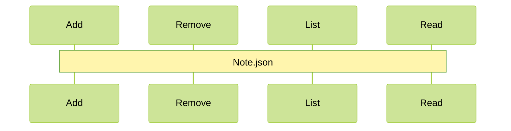

# Notes app

In this project the focus was work only with NodeJS.

---

    Here I used nodeJS, yargs, chalk and
    validator, it's a Notes app with a simple CRUD.

- To work with this project you might use the terminal to do all the commands.

###

### If you want to test, the first of all is:

    npm install

### To add:

    node app.js add --title=" " --body=" "

### To remove:

    node app.js remove --title=" "

### To read one:

    node app.js read --title=" "

### To list all:

    node app.js list

---

> "Ok, but where can I see this notes changing?"

That´s a good question! everything happens in a file called _notes.json_

####

###

- Everything occurs in the file _note.js_, there you'll see the messages that appear in terminal, the logic that make the CRUD and infos from _notes.json_ when use the command "read" or "list".

---

That´s all folks, thanks for rading! See you...🥷🥷
